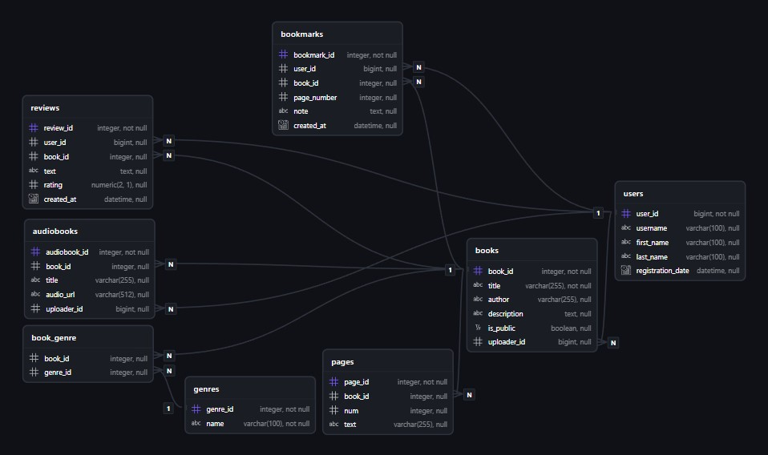

# BookBot

Bookbot is a telegam bot to read books, listen to audiobooks and leave reviews to them.

## Requirements

Before starting work, make sure that you have installed:

- **Python** (versions 3.10-3.13) - [download](https://www.python.org/downloads/)
- **Git** - [download](https://git-scm.com/downloads)

## Project Launch

### 1. Clone repository

```commandline
git clone https://github.com/Silent0agent/telegram_book_bot
```

### 2. Go to the project folder

```commandline
cd telegram_book_bot
```

### 3. Create a virtual environment

Linux/macOS:

```bash
python3 -m venv venv
```  

Windows:

```batch
python -m venv venv
```  

### 4. Activate the virtual environment

Linux/macOS:

```bash
source venv/bin/activate
```  

Windows:

```batch
.\venv\Scripts\activate.bat
```  

### 5. Install the necessary libraries in the virtual environment

Production (minimum set):

```commandline
pip install -r requirements/prod.txt
```

Development (production + development tools):

```commandline
pip install -r requirements/prod.txt
pip install -r requirements/dev.txt
```

Testing (production + testing tools):

```commandline
pip install -r requirements/prod.txt
pip install -r requirements/test.txt
```

Full development setup (all at once):

```commandline
pip install -r requirements/prod.txt
pip install -r requirements/dev.txt
pip install -r requirements/test.txt
```

### 6. Copy the configuration template and edit the .env file to suit your needs

Linux/macOS:

```bash
cp .env.example .env
```

Windows:

```batch
copy .env.example .env
```

### 7. Run bot

Linux/macOS:

```bash
python3 main.py
```

Windows:

```batch
python main.py
```

## ER Diagram


